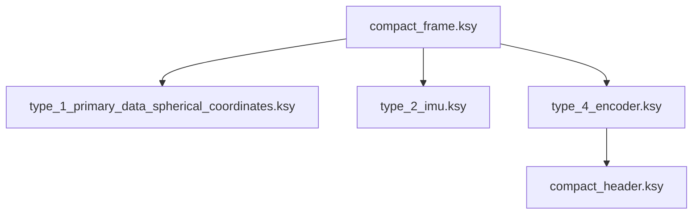

<div align="center">


<br/>


# KaitaiStructDescriptions

Kaitai Struct format descriptions for the SICK LiDAR Compact Format.
Generate ready-to-use parsers in Python, C#, Java, C++, Go, and more without writing parsing code by hand.


[](https://github.com/SICKAG/KaitaiStructDescriptions)
[](https://github.com/SICKAG/KaitaiStructDescriptions/issues)

[Quickstart with Python](#quickstart-with-python) • [Web IDE](#web-ide-no-installation-required)

</div>

---

## Format Overview

All compact telegrams share the same outer frame (`compact_frame.ksy`).
The `telegram_type` field selects the payload type:

| Type | Name         | `.ksy` file                                     | Sensors                             |
| ---: | ------------ | ----------------------------------------------- | ----------------------------------- |
|    1 | Primary Data | `type_1_primary_data_spherical_coordinates.ksy` | picoScan100, multiScan100, LRS4000 |
|    2 | IMU          | `type_2_imu.ksy`                                | picoScan100, multiScan100          |
|    4 | Encoder      | `type_4_encoder.ksy`                            | picoScan150                        |

All `.ksy` files are located in the `formats/` directory.

> **Note:** More details on the individual formats can be found in the respective operating instructions of each sensor.

---

## Architecture

`compact_frame.ksy` is the entry point. It dispatches to the matching payload type based on `telegram_type`.
Type 4 uses the common header sub-type in `compact_header.ksy`. (This header will be used in all future compact telegram types.) Types 1 and 2 use their own header layouts.



---

## Quickstart with Python

### 1. Install the Kaitai Struct Compiler

Download `ksc` from <https://kaitai.io/#download> and add it to your `PATH`.
Java 8 or later is required.

### 2. Generate the Python parser

```bash
kaitai-struct-compiler -t python --outdir . formats/compact_frame.ksy
```

This writes `compact_frame.py` and all imported payload modules into the current directory.

### 3. Install the runtime and parse

```bash
pip install kaitaistruct
```

```python
import socket
from kaitaistruct import KaitaiStream, BytesIO
from compact_frame import CompactFrame

sock = socket.socket(socket.AF_INET, socket.SOCK_DGRAM)
sock.bind(("", 2115))
raw, _ = sock.recvfrom(65535)

frame = CompactFrame(KaitaiStream(BytesIO(raw)))
print(f"telegram_type : {frame.telegram_type}")
print(f"checksum      : 0x{frame.checksum:08x}")

if frame.telegram_type == 1:
    header = frame.payload.header
    print(f"telegram version : {header.telegram_version}")
    print(f"modules          : {len(frame.payload.module)}")

elif frame.telegram_type == 2:
    imu = frame.payload
    print(f"accel  : x={imu.acceleration.x:.4f}  y={imu.acceleration.y:.4f}  z={imu.acceleration.z:.4f}")
    print(f"gyro   : x={imu.angular_velocity.x:.4f}  y={imu.angular_velocity.y:.4f}  z={imu.angular_velocity.z:.4f}")

elif frame.telegram_type == 4:
    enc = frame.payload
    print(f"telegram counter : {enc.header.telegram_counter}")
    print(f"tick count       : {enc.tick_count}")
    print(f"speed            : {enc.speed:.3f}")
```

---

## Web IDE (no installation required)

Open the [Kaitai Web IDE](https://ide.kaitai.io/#) in your browser and drag any `.ksy` file from the `formats/` directory onto the page. To generate a parser:

1. Right-click the imported file in the file tree on the left.
2. Select **Generate Parser** and choose your target language.
3. The generated code appears on the right.

---

## Known Issues

### `num_*` style warnings during compilation

When compiling, kaitai-struct-compiler may emit style-guide warnings such as
`use 'num_elevation_angles' instead of 'number_of_layers'` for count fields in
`type_1_primary_data_spherical_coordinates.ksy`.

These warnings are expected and safe to ignore.

---

## Support

Please open a GitHub issue for bugs or questions.
